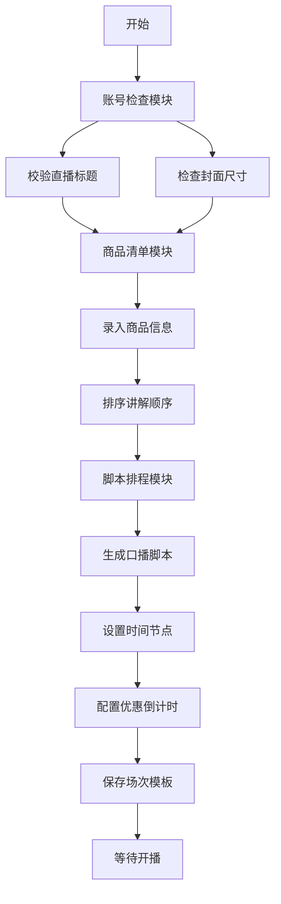
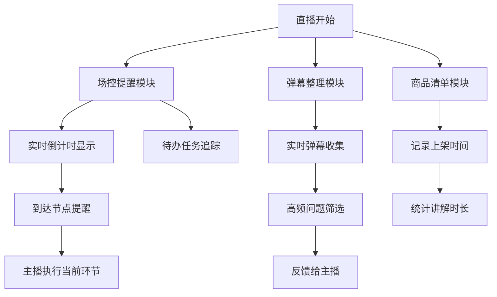
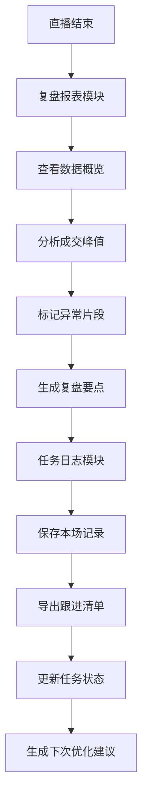

## 1. 产品概述

直播电商运营自动化工具，面向电商直播运营人员，帮助处理开播前后的重复性事务，提升直播运营效率，减少人工疏漏。通过七个核心模块覆盖直播前准备、直播中场控、直播后复盘的全流程管理。

- 核心价值：将直播运营的重复工作标准化、自动化，让运营人员聚焦策略优化
- 目标用户：电商直播运营、场控、主播助理

## 2. 核心功能

### 2.1 功能模块总览

| 序号 | 模块名称 | 核心功能 | 所属阶段 |
|------|----------|----------|----------|
| 1 | 账号检查 | 校验直播标题、检查封面尺寸、账号状态检测 | 开播前 |
| 2 | 商品清单 | 核对商品库存、排序讲解商品、记录上架时间 | 开播前/中 |
| 3 | 脚本排程 | 生成口播脚本、设置优惠倒计时、排程节点管理 | 开播前 |
| 4 | 场控提醒 | 提醒主播节点、实时倒计时、未完成任务提醒 | 直播中 |
| 5 | 弹幕整理 | 筛选高频问题、汇总弹幕反馈、关键词分析 | 直播中/后 |
| 6 | 复盘报表 | 标记异常片段、生成复盘要点、统计成交峰值 | 直播后 |
| 7 | 任务日志 | 保存场次模板、导出跟进清单、任务完成追踪 | 全流程 |

### 2.2 页面详情

| 页面名称 | 模块名称 | 功能描述 |
|-----------|-------------|---------------------|
| 账号检查 | 标题校验 | 输入直播标题，自动检测字数、敏感词、吸引力评分 |
| 账号检查 | 封面检测 | 上传封面图，自动检测尺寸比例、清晰度、合规性 |
| 账号检查 | 账号状态 | 展示账号健康度、开播权限、违规记录概览 |
| 商品清单 | 商品列表 | 展示本场直播商品，支持增删改查、库存显示 |
| 商品清单 | 讲解排序 | 拖拽排序商品讲解顺序，标记主推/辅推商品 |
| 商品清单 | 上架记录 | 记录每个商品的实际上架时间、讲解时长 |
| 脚本排程 | 口播脚本 | 根据商品列表自动生成口播脚本模板，可编辑调整 |
| 脚本排程 | 时间节点 | 设置直播各阶段时间点（开场、主推、互动、收尾） |
| 脚本排程 | 优惠倒计时 | 配置优惠活动开始/结束时间，生成倒计时组件 |
| 场控提醒 | 节点提醒 | 到达预设节点时弹出提醒，显示当前环节内容 |
| 场控提醒 | 实时看板 | 展示直播进度条、当前商品、下一个节点倒计时 |
| 场控提醒 | 待办提醒 | 展示未完成任务清单，高亮紧急待办 |
| 弹幕整理 | 高频问题 | 自动统计弹幕中重复出现的问题，按频次排序 |
| 弹幕整理 | 反馈汇总 | 按正面/负面/中性分类弹幕，生成词云展示 |
| 弹幕整理 | 弹幕搜索 | 关键词搜索弹幕，支持时间范围筛选 |
| 复盘报表 | 数据概览 | 展示观看人数、成交金额、互动率等核心指标 |
| 复盘报表 | 成交峰值 | 标记成交高峰时间段，关联当时讲解的商品 |
| 复盘报表 | 异常标记 | 记录直播中的异常片段（卡顿、违规、突发情况） |
| 复盘报表 | 复盘要点 | 自动生成复盘要点清单，支持人工补充 |
| 任务日志 | 场次管理 | 历史场次列表，支持查看、复制、删除模板 |
| 任务日志 | 模板保存 | 将当前配置保存为模板，下次开播直接复用 |
| 任务日志 | 导出清单 | 导出待跟进事项清单（Excel/CSV格式） |
| 任务日志 | 任务追踪 | 展示各项任务完成状态，统计完成率 |

## 3. 核心流程

### 3.1 直播前准备流程

运营人员进入工具后，首先进行账号检查（标题、封面），然后录入本次直播的商品清单并排序讲解顺序，接着基于商品和时间安排生成口播脚本与时间节点，最后保存为本次直播的模板。

### 3.2 直播中场控流程

直播开始后，场控提醒模块实时运行，根据预设的时间节点提醒主播，同时弹幕整理模块实时收集和分析弹幕，商品清单模块记录商品上架时间。

### 3.3 直播后复盘流程

直播结束后，运营人员通过复盘报表模块查看数据、标记异常、生成复盘要点，最后通过任务日志模块导出跟进清单。

## 4. 用户界面设计

### 4.1 设计风格

**整体定位：** 专业、高效、科技感的运营工具界面

- **主色调：** 深海蓝 (#0F172A) 作为主背景色，搭配电光蓝 (#3B82F6) 作为主色
- **辅助色：** 翡翠绿 (#10B981) 表示成功/正常，琥珀橙 (#F59E0B) 表示警告，玫红 (#EF4444) 表示错误
- **中性色：**  slate 系列灰色，确保文字层级清晰
- **按钮风格：** 微圆角 (6px)，悬浮时有轻微上浮和发光效果
- **字体：** -apple-system, BlinkMacSystemFont, "Segoe UI", "PingFang SC", "Microsoft YaHei" 等无衬线字体，数字使用等宽字体增强数据感
- **布局风格：** 左侧导航栏 + 右侧内容区的经典布局，卡片式模块划分
- **图标风格：** 线性图标，统一粗细，配合色彩编码表示状态
- **数据可视化：** 使用简洁的图表组件，强调数据的可读性

### 4.2 页面设计概览

| 页面名称 | 模块名称 | UI 元素 |
|-----------|-------------|----------|
| 账号检查 | 标题校验 | 输入框、字数计数器、评分进度条、问题提示列表 |
| 账号检查 | 封面检测 | 上传区域、预览框、尺寸标注、检测结果卡片 |
| 商品清单 | 商品列表 | 表格视图、库存标签、操作按钮、拖拽手柄 |
| 商品清单 | 讲解排序 | 可拖拽卡片列表、序号标记、主推/辅推标签 |
| 脚本排程 | 口播脚本 | 分区编辑器、时间轴、商品关联标签、快捷插入按钮 |
| 脚本排程 | 时间节点 | 时间轴视图、节点卡片、颜色编码、可拖动调整 |
| 场控提醒 | 实时看板 | 大字号倒计时、当前环节卡片、进度条、下一项预告 |
| 场控提醒 | 待办提醒 | 任务列表、优先级标记、完成勾选、紧急高亮 |
| 弹幕整理 | 高频问题 | 排名列表、频次柱状图、问题归类标签 |
| 弹幕整理 | 反馈汇总 | 分类统计卡片、词云区域、情感分析占比图 |
| 复盘报表 | 数据概览 | 指标卡片网格、趋势折线图、对比数据 |
| 复盘报表 | 成交峰值 | 时间轴峰值标记、峰值详情卡片、商品关联 |
| 任务日志 | 场次管理 | 卡片列表、日期筛选、模板标记、操作菜单 |
| 任务日志 | 导出清单 | 数据表格、导出格式选择、字段勾选 |

### 4.3 响应式设计

- **桌面端优先：** 面向运营人员，主要在电脑端使用，分辨率适配 1366px ~ 1920px
- **侧边导航：** 固定宽度 240px 左侧导航，内容区自适应
- **平板适配：** 导航栏可折叠为图标模式，内容区重新排列
- **数据密度：** 信息密度较高，适合专业运营人员快速获取信息

### 4.4 动效与交互

- **页面切换：** 淡入淡出过渡，配合轻微的位移动画
- **卡片悬浮：** 轻微上浮 (translateY(-2px))，阴影加深
- **按钮点击：** 缩放反馈 (scale(0.97))
- **提醒动画：** 重要提醒使用脉冲动画 + 数字红点
- **进度条：** 平滑过渡动画，数值变化有缓动效果
- **数据加载：** 骨架屏占位，内容渐入
