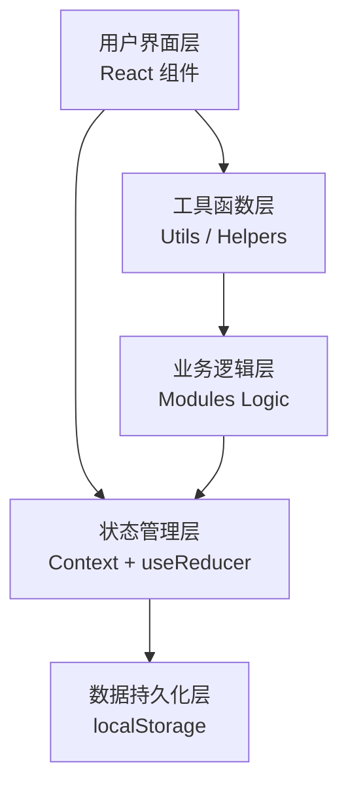
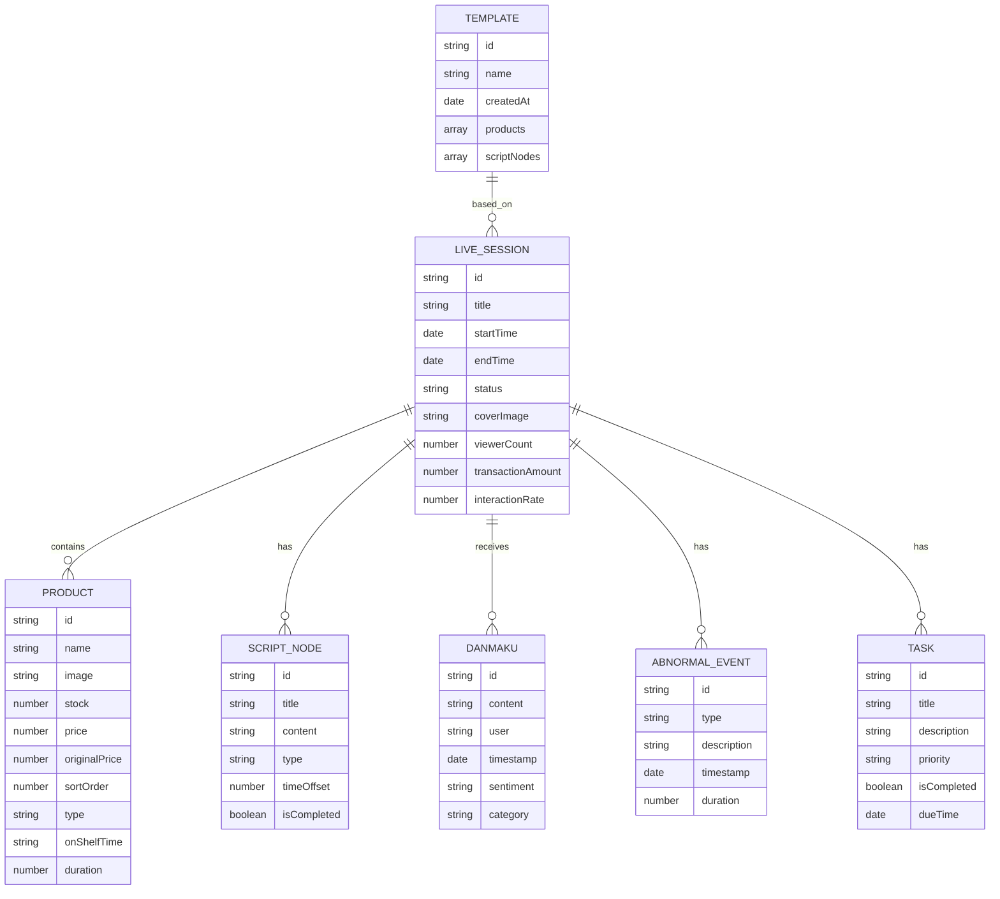

## 1. 架构设计

本项目为纯前端单页应用（SPA），使用 React + Vite + TailwindCSS 构建，数据通过 localStorage 持久化存储，无需后端服务。



## 2. 技术描述

### 2.1 技术栈

- **前端框架：** React 18 + TypeScript
- **构建工具：** Vite 5
- **样式方案：** TailwindCSS 3
- **状态管理：** React Context + useReducer
- **路由管理：** React Router v6
- **图标库：** Lucide React
- **数据存储：** localStorage（本地持久化）
- **拖拽库：** @dnd-kit/core + @dnd-kit/sortable
- **图表库：** Recharts

### 2.2 工程化配置

- **包管理器：** npm
- **代码规范：** ESLint
- **目录结构：** 按功能模块组织，便于维护和扩展

## 3. 路由定义

| 路由路径 | 页面名称 | 模块功能 |
|----------|----------|----------|
| `/` | 首页/总览 | 快速入口、今日任务概览 |
| `/account-check` | 账号检查 | 标题校验、封面检测、账号状态 |
| `/products` | 商品清单 | 商品管理、讲解排序、上架记录 |
| `/script` | 脚本排程 | 口播脚本、时间节点、优惠倒计时 |
| `/control` | 场控提醒 | 实时看板、节点提醒、待办任务 |
| `/danmaku` | 弹幕整理 | 高频问题、反馈汇总、弹幕搜索 |
| `/review` | 复盘报表 | 数据概览、成交峰值、异常标记 |
| `/tasks` | 任务日志 | 场次管理、模板保存、导出清单 |

## 4. 数据模型

### 4.1 数据模型定义



### 4.2 核心数据结构 TypeScript 定义

```typescript
// 直播场次
interface LiveSession {
  id: string;
  title: string;
  startTime: string;
  endTime?: string;
  status: 'draft' | 'ongoing' | 'completed';
  coverImage?: string;
  viewerCount: number;
  transactionAmount: number;
  interactionRate: number;
  createdAt: string;
  updatedAt: string;
}

// 商品
interface Product {
  id: string;
  name: string;
  image?: string;
  stock: number;
  price: number;
  originalPrice: number;
  sortOrder: number;
  type: 'main' | 'secondary' | 'bonus';
  onShelfTime?: string;
  duration?: number;
  description?: string;
}

// 脚本节点
interface ScriptNode {
  id: string;
  title: string;
  content: string;
  type: 'opening' | 'product' | 'interaction' | 'promotion' | 'closing';
  timeOffset: number;
  isCompleted: boolean;
  relatedProductId?: string;
}

// 弹幕
interface Danmaku {
  id: string;
  content: string;
  user: string;
  timestamp: string;
  sentiment: 'positive' | 'negative' | 'neutral';
  category: string;
}

// 异常事件
interface AbnormalEvent {
  id: string;
  type: 'technical' | 'content' | 'emergency';
  description: string;
  timestamp: string;
  duration: number;
}

// 任务
interface Task {
  id: string;
  title: string;
  description: string;
  priority: 'high' | 'medium' | 'low';
  isCompleted: boolean;
  dueTime?: string;
  category: string;
}

// 模板
interface Template {
  id: string;
  name: string;
  createdAt: string;
  products: Product[];
  scriptNodes: ScriptNode[];
  tasks: Task[];
}
```

## 5. 目录结构

```
src/
├── components/          # 通用组件
│   ├── Layout/         # 布局组件
│   ├── Card/           # 卡片组件
│   ├── Button/         # 按钮组件
│   ├── Modal/          # 弹窗组件
│   └── Progress/       # 进度条组件
├── pages/              # 页面组件
│   ├── Dashboard/      # 首页总览
│   ├── AccountCheck/   # 账号检查
│   ├── Products/       # 商品清单
│   ├── Script/         # 脚本排程
│   ├── Control/        # 场控提醒
│   ├── Danmaku/        # 弹幕整理
│   ├── Review/         # 复盘报表
│   └── Tasks/          # 任务日志
├── context/            # 状态管理
│   ├── LiveContext.tsx
│   └── types.ts
├── hooks/              # 自定义 Hooks
│   ├── useLocalStorage.ts
│   ├── useCountdown.ts
│   └── useDragSort.ts
├── utils/              # 工具函数
│   ├── storage.ts
│   ├── format.ts
│   ├── validation.ts
│   └── mockData.ts
├── styles/             # 全局样式
│   └── index.css
├── App.tsx
├── main.tsx
└── vite-env.d.ts
```

## 6. 功能模块实现方案

### 6.1 账号检查模块

- **标题校验：** 基于规则的本地校验（字数、敏感词库、关键词匹配评分）
- **封面检测：** 使用 Canvas API 获取图片尺寸，校验比例和大小
- **账号状态：** 模拟数据展示，支持手动更新状态

### 6.2 商品清单模块

- **商品列表：** 表格展示，支持增删改查
- **讲解排序：** 使用 @dnd-kit 实现拖拽排序
- **上架记录：** 记录上架时间，计算讲解时长

### 6.3 脚本排程模块

- **口播脚本：** 基于商品列表自动生成脚本模板，支持富文本编辑
- **时间节点：** 时间轴可视化，支持拖拽调整
- **优惠倒计时：** 配置优惠时间，生成倒计时组件

### 6.4 场控提醒模块

- **实时看板：** 大字号倒计时，当前环节高亮
- **节点提醒：** 使用 Notification API + 页面内弹窗提醒
- **待办提醒：** 任务列表，优先级排序，已完成任务置灰

### 6.5 弹幕整理模块

- **高频问题：** 模拟弹幕数据，关键词统计排序
- **反馈汇总：** 情感分类统计，简单词云展示
- **弹幕搜索：** 关键词过滤，时间范围筛选

### 6.6 复盘报表模块

- **数据概览：** 指标卡片 + 趋势图表（Recharts）
- **成交峰值：** 时间轴峰值标记，关联商品
- **异常标记：** 异常事件列表，支持添加备注

### 6.7 任务日志模块

- **场次管理：** 历史场次卡片列表，支持筛选
- **模板保存：** 将当前配置保存为模板，支持复制使用
- **导出清单：** 生成 CSV 格式文件下载

## 7. 状态管理方案

使用 React Context + useReducer 实现全局状态管理：

- **LiveContext:** 管理当前直播场次的所有数据
- **TemplateContext:** 管理模板相关数据
- 状态变更通过 dispatch 触发，保证数据流单向
- 使用 localStorage 中间件实现数据持久化
